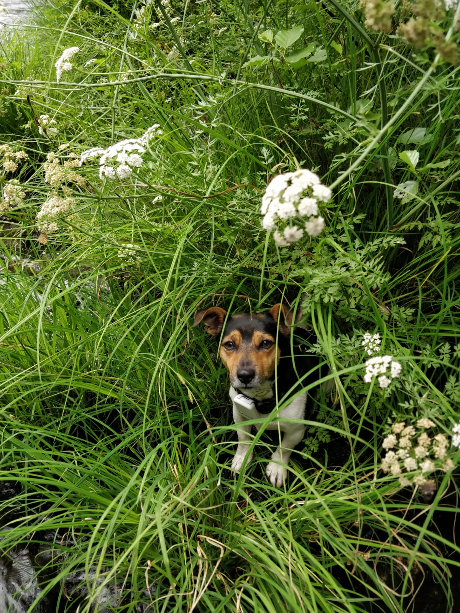

# Página WEB Github de Pablo de Andrés Vales.

Listado de proyectos pendientes:

1. Cambio de extrusor y cabezal impresora 3D.
2. Instalación de GPS en el coche.
3. Configurar NODE-RED para recibir ubicación del GPS del coche.
4. Instalación de GPS en el Kayak.
5. Configurar NODE-RED para recibir ubicación de GPS del Kayak y compartirla.

[Proenotec Systemas](https://www.proenotec.com)

[Enlace a referencia.md](referencias.md)

``

>Es mejor estar callado y parecer tonto, que abrir la boca y despejar las dudas. - Groucho Marx

